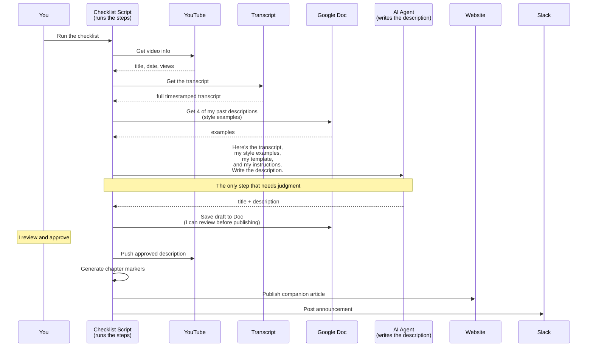

I hate posting YouTube videos.

That's not true. I love the recording process and I love sharing with the community. But I hate *posting* them — updating descriptions, adding cross-links, wrestling with social links, even coming up with titles. I disliked it so much, had several videos with no description at all. Just a title and nothing else.

When I rebranded from Onyx Reporting to DataCrew, the prospect of redoing all the descriptions across my 200+ videos sounded awful. I had to automate it.

Full disclosure – Claude wrote the first draft of this article – it didn’t feel personal enough so I prompted it with some cues and added this opening to make it feel personal and specific to me

## AI Is a [really smart] New Hire

I know, AI isn’t perfect, it doesn't sound like you. It misses details you'd never miss. And you spend more time fixing it than doing it yourself.  Here's what I learned.

You don’t have a technology problem. You have a **training problem.** You wouldn't hand a new hire analyst a blank page and say "write a client report." You'd give them a template, examples of reports you've approved, a list of things to always include, and a review cycle before anything goes out. AI needs the same thing. The difference is: once you teach it, it *actually remembers.* Training sticks.

**AI is like a really smart new hire.** It can process information fast, it can write well, and it never sleeps. But just like any new hire, it needs to be taught how *you* want things done. It needs an SOP. It needs style examples. And it needs a memory — so it doesn't forget what you taught it between conversations.

## Finding the Sweet Spot

I couldn’t ask you to just “write a description for my videos.  There’s a whole SOP behind it

Fetch the video's metadata and transcript, write a professional title and description, push the description to YouTube, generate chapter markers, write a companion article on my website, post an announcement to Slack, and update my tracking doc.

Six of those steps are mechanical — fetch data, format it, post it – super easy even to automate without AI. One step — writing the description — requires judgment. It needs to sound like me, hit the right audience, and include the right details.

This whole workflow represents the sweet spot for AI automation: **a repeatable workflow where most steps are mechanical, but one or two need a human's touch.** If you've ever thought "I do this same thing every week and it takes an hour," you've found a candidate.

## A Checklist, Not a Conversation

I broke the workflow steps into and decided which ones need judgment and which ones just need a script. Then I built a checklist that runs the whole thing:

In AI we talk about “deterministic” results - stuff that must be the same way every time – have Claude write scripts (pro tip: ask Claude to “write a parameterized CLI”).  For the generate description phase, ask Claude to “create a parameterized CLI that receives this youtube transcript along with my instructions for how to sound like me (a .md document), and run it using Claude in headless mode”.  Even the act of being creative is also a script!

Then stitch it all together using a runbook.  “Create a runbook that executes these tasks…” – it helps Claude to give it a goal “You are a content manager for … , your goal is to … , execute these tasks using these scripts, then update the video on YouTube.”

This is the opposite of "just ask ChatGPT to figure it out."  Yeah, it takes maybe a half day to stitch it all together – Claude has to write 7 scripts for you.  But the real accelerator is giving Claude the information they need to do a good first pass at the script before we add HITL (Human in the Loop).  – Even right now, I’m 20 minutes into updating this article (in Google Docs where I told Claude to store their pass of this article – when I’m done I’ll have Claude download the script and push it to my website).

## Teaching the AI Your Voice

This is the part most people skip — and it's why their AI output feels generic. I spent real time teaching my AI how I write. Four things:

**A memory file.** My AI agent has a persistent memory — a file that travels across every conversation. It contains who I am, my writing style, my audience, and things to never do (never invent contact info, never modify my social links). Think of this like the onboarding document you'd give a new hire on day one.

**Style examples.** Before the AI writes a new description, the script pulls 4 of my existing descriptions from my Google Doc and shows them to the AI. "Here's what I've written before. Match this tone." AI is *very good* at pattern matching. Give it good examples and it will match them.

**A standing template.** Every description follows the same structure: summary, chapter markers, article link, contact info, social links. The AI fills in the summary; the script handles the rest. You wouldn't let a new analyst invent the format from scratch. Don't let the AI either.

**Standing instructions.** My config file includes rules that ship with every AI call: "Keep the summary concise. Focus on what the viewer will learn. Add 3–8 relevant hashtags." These are the editorial guidelines — the things you'd tell a new analyst once and expect them to remember forever.

The result: my AI writes descriptions that sound like me. Not because I fine-tuned a model. Because I gave it **a memory, examples, a template, and rules.** That's the pattern.

## What About MCPs?

You might have heard of MCPs — a way for AI to discover and call tools on external systems. An MCP for Google Docs would let the AI directly read and write your documents. That's useful for platform integrations.

But for my workflow, I chose scripts instead. A script always does the same thing in the same order. I can preview every step before it runs. And the AI doesn't waste context space knowing about tools it might not call.

For the deterministic steps — like "update the Google Doc tab with the generated description" — you could use an MCP, direct API calls, or a custom library. I built my own ([cboti](https://github.com/jaewilson07/cboti)) because I interact with Google Docs in very specific ways. The key decision isn't "MCP or script" — it's **"who decides what to do next?"** For repeatable workflows, the answer should be the script.

For more on this, I did a [live debate with Jon Tiritilli from Domo](http:///blog/mcps-vs-skills-the-debate) that goes deeper.

## Your Turn

Everyone has a problem like this. Something you do repeatedly that takes too long and feels like busywork. It could be:

- Taking project notes and turning them into Jira tickets
- Drafting proposals for consulting projects
- Building a sales funnel outreach program
- Writing weekly status reports
- Onboarding new clients with the same checklist every time

Ask yourself:

1. **Is this recurring?** Do you do it more than twice?
1. **Is it multi-step?** Does it involve 3+ actions across different systems?
1. **Is it partially mechanical?** Could you script most of it, but one step needs your judgment?

If yes, you have a runbook candidate. The AI's job is the judgment step. Your job is teaching it how to do that step the way you would. And once you teach it, it remembers.  I told Claude “write an article about how I build runbooks” – and this is what it came up with!

## Want Help Building This?

I work with teams to design and implement AI automation workflows — from identifying which tasks deserve runbooks to building the scripts, teaching agents your voice, and upskilling your team to maintain and extend the system on their own.

Whether you're a Domo customer looking to automate your analytics pipeline, or a team that wants to build AI-assisted workflows around your existing tools, I can help you figure out where AI actually earns its keep and where a script is all you need.

[Get in touch →](http:///contact)

*This pattern came out of a live debate on MCPs vs Skills with Jon Tiritilli (Domo Principal Engineer). Watch the full discussion:*
